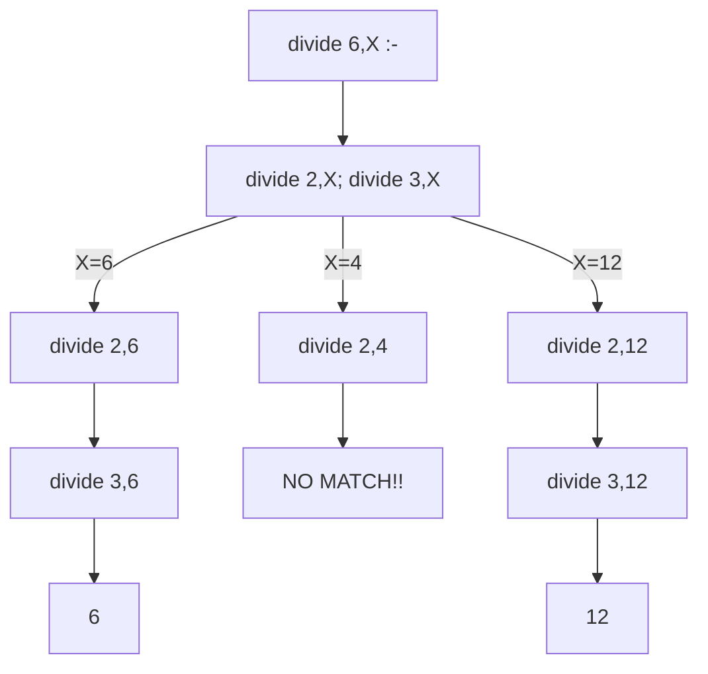
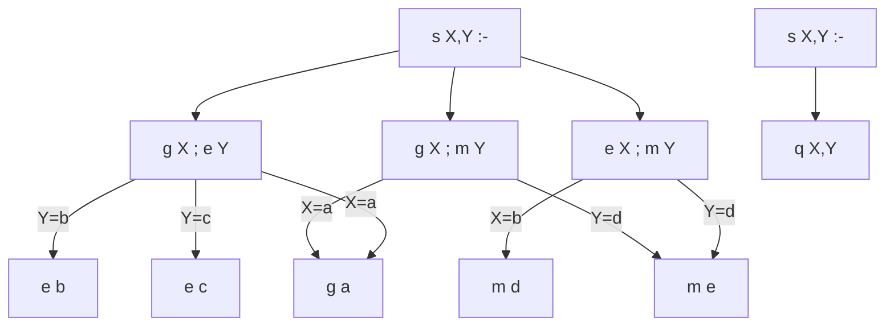

```mermaid
graph TD

00[divide 6,X :-] 
0[divide 2,X; divide 3,X]

00 --> 0

1[divide 2,6]
2[divide 2,4]
3[divide 2,12]

0 -- "X=6" --> 1
0 -- "X=4" --> 2
0 -- "X=12" --> 3

4[divide 3,6]
5[NO MATCH!!]
6[divide 3,12]

1 --> 4
2 --> 5
3 --> 6

4 --> 7[6]
6 --> 8[12]
```

```mermaid
graph TD

00[s X,Y  :-]
0[g X ; e Y ]
1[e X ; m Y ]
2[g X ; m Y ]

00 --> 0
00 --> 1
00 --> 2

3[g a ]
4[e b ]
5[e c ]
6[m d ]
7[m e ]

0 -- "X=a" --> 3
0 -- "Y=b" --> 4
0 -- "Y=c" --> 5
1 -- "X=b" --> 6
1 -- "Y=d" --> 7
2 -- "X=a" --> 3
2 -- "Y=d" --> 7

8[s X,Y  :-]
9[q X,Y ]

8 --> 9

```